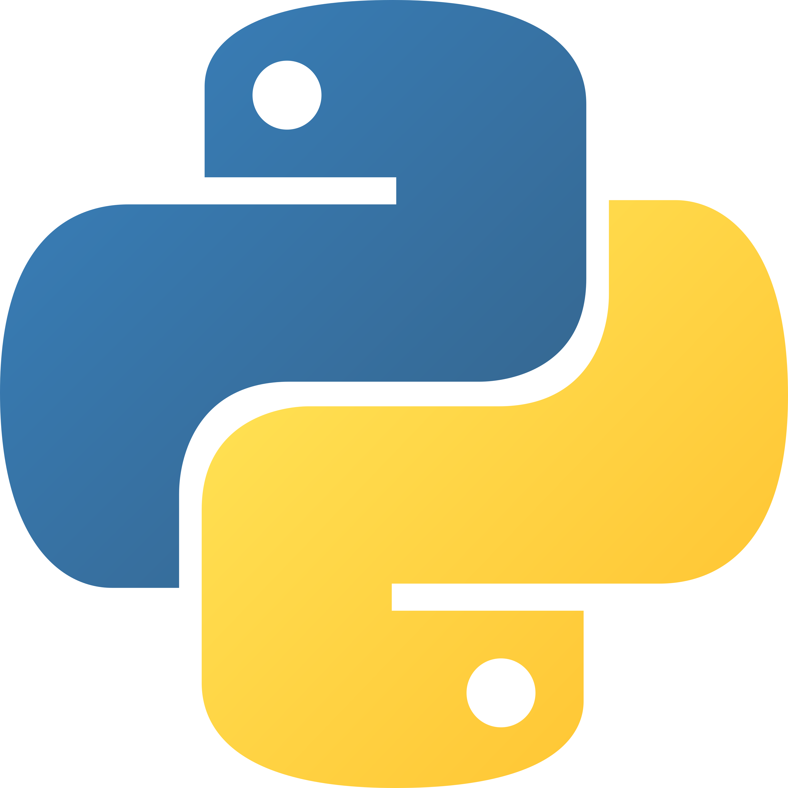
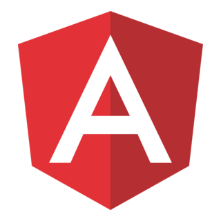
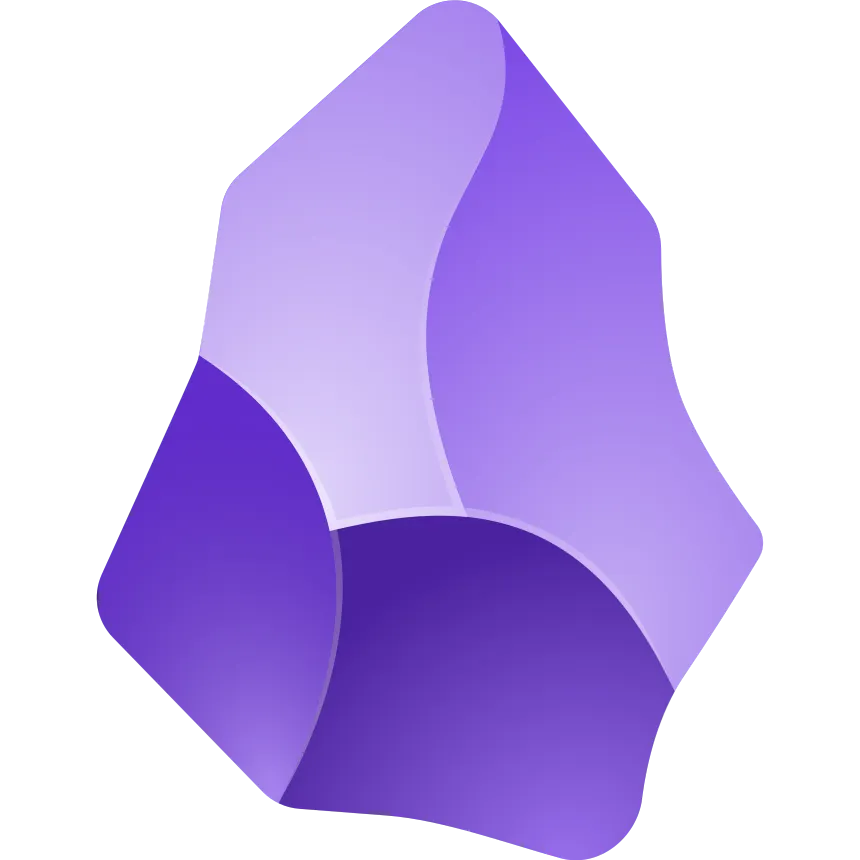

### Hello, world 👋

I'm Naoto - a mishmash of film, music, and engineering.

## 🔍 Current focus
- Building clean, usable frontends (Angular / React)
- Thinking more about UX & HCI, not just implementation
- Improving how I explain technical decisions

🛠️ Tools
--- 
        

<!--
**otoaneba/otoaneba** is a ✨ _special_ ✨ repository because its `README.md` (this file) appears on your GitHub profile.

Here are some ideas to get you started:

- 🔭 I’m currently working on ...
- 🌱 I’m currently learning ...
- 👯 I’m looking to collaborate on ...
- 🤔 I’m looking for help with ...
- 💬 Ask me about ...
- 📫 How to reach me: ...
- 😄 Pronouns: ...
- ⚡ Fun fact: ...
-->
